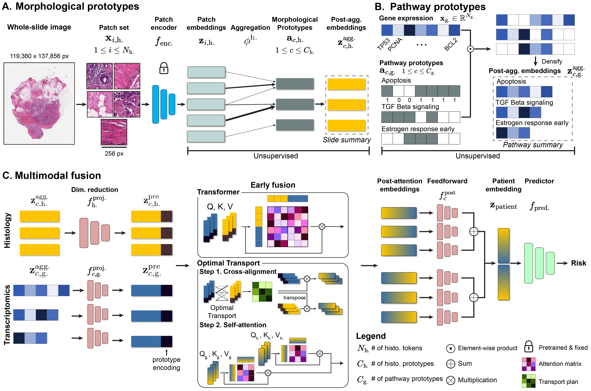
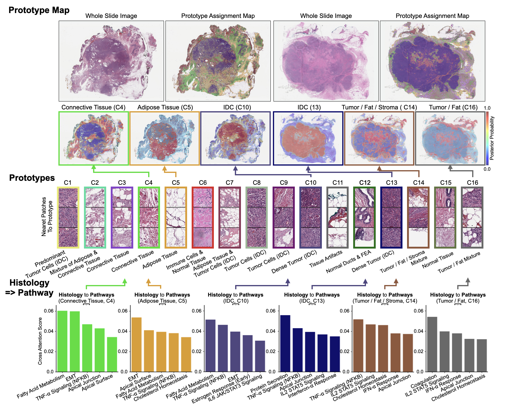

# MMP


  <b>Multimodal Prototyping for cancer survival prediction</b>, ICML 2024.
	<br><em>Andrew H. Song, Richard J. Chen, Guillaume Jaume, Anurag Vaidya, Alexander S. Baras, Faisal Mahmood</em></br>


[Paper](https://openreview.net/pdf?id=3MfvxH3Gia) | [Cite](#cite)

**Abstract:** Multimodal survival methods combining gigapixel histology whole-slide images (WSIs) and
transcriptomic profiles are particularly promising for patient prognostication and stratification.
Current approaches involve tokenizing the WSIs into smaller patches (> 10k patches) and transcriptomics into gene groups, which are then integrated using a Transformer for predicting outcomes. However, this process generates many
tokens, which leads to high memory requirements for computing attention and complicates post-hoc interpretability analyses. Instead, we hypothesize that we can: (1) effectively summarize the morphological content of a WSI by
condensing its constituting tokens using morphological prototypes, achieving more than 300× compression; and (2) accurately characterize cellular functions by encoding the transcriptomic profile with biological pathway prototypes, all
in an unsupervised fashion. 

We introduce **M**ulti**M**odal **P**rototyping framework (**MMP**), where the resulting multimodal tokens are then processed by a fusion network, either with a Transformer or an optimal transport cross-alignment, which now operates with a small and fixed number of tokens without approximations. Extensive evaluation shows that our framework outperforms state-of-the-art methods with much less computation while unlocking new interpretability analyses.

**MMP** (a.k.a. **M**ulti**M**odal **P**anther) is a multimodal extension of our companion work **PANTHER** (*CVPR 2024*, [paper](https://openaccess.thecvf.com/content/CVPR2024/html/Song_Morphological_Prototyping_for_Unsupervised_Slide_Representation_Learning_in_Computational_Pathology_CVPR_2024_paper.html), [code](https://github.com/mahmoodlab/PANTHER)), so we encourage you to check it out!



## Updates
- 07/02/2024: The first version of MMP codebase is now live!

## Installation
Please run the following command to create MMP conda environment.
```shell
conda env create -f environment.yml
```

## MMP Walkthrough
MMP can largely be broken down into four steps:

**Step 1**: Construct histology prototypes (across the specific cancer cohort) and aggregate tissue patch tokens to the each prototype for each patient.\
**Step 2**: Construct pathway prototypes and aggregate transcriptomic expression tokens to each prototype for each patient.\
**Step 3**: Fuse aggegated histology and pathway embeddings and perform downstream task.\
**Step 4**: Visualization.

### Step 1. Morphology prototype construction
A concrete script example of using TCGA-BRCA patch features can be found below.
```shell
cd src
./scripts/prototype/brca.sh 0
```
This will initiate the script `scripts/prototype/clustering.sh` for K-means clustering. Detailed explanations on hyperparameters can be found in [clustering.sh](src/scripts/prototype/clustering.sh). 

For more instructions on **Step 1**, please refer to the instructions (**Step 0** and **Step 1**) in [PANTHER](https://github.com/mahmoodlab/PANTHER).

### Step 2. Pathway prototype construction
First, we need to download the pancancer-normalized TCGA transcriptomics expression data from Xena database.\
Next, using **hallmark oncogene sets** (located in `src/data_csvs/rna/metadata/hallmarks_signatures.csv`), we filter the genes that are subset of hallmark pathways. Note that MMP can be extended to other pathways as well.
Detailed instructions can be found in the [notebook](src/preprocess_pancancer_TCGA_normalized_RNA.ipynb).

### Step 3. Multimodal Fusion
We can run a downstream task as follows (The data splits for TCGA cohorts used in our study can be found in `src/splits/survival`)
```shell
cd src
./scripts/survival/brca_surv.sh 0 mmp
``` 
where [mmp](src/scripts/survival/mmp.sh) is a bash script that contains argument examples.


MMP currently supports 
- **Prototype-based multimodal fusion**: Two possible approaches. `model_mm_type=coattn` (Transformer-based full-attention) or `model_mm_type=coattn_mot` (OT-based cross-attention). 
  - For histology aggregation approach, you can specify PANTHER or OT (`model_histo_type=PANTHER,default` or `model_histo_type=OT,default`)
- **SurvPath**: Adapted from [SurvPath](https://github.com/mahmoodlab/SurvPath). Specify `model_mm_type=survpath` and `model_histo_type=mil,default`.
  - Example script available in [survpath](src/scripts/survival/survpath.sh).
- **Unimodal prototype baselines**: Use either `model_mm_type=histo` (histology prototypes only) or `model_mm_type=gene` (pathway prototypes only).


### Step 4. Visualization

The instructions for visualizations of prototype assignment map and histology => pathway & pathway => histology interactions are explained in the [notebook](src/visualization/mmp_visualization.ipynb). Currently only `model_mm_type=coattn` is supported.



## MMP future directions
As emphasized in the paper, multimodal survival analysis is a challenging clinical task that has seen significant interest in the biomedical,  computer vision, and machine learning communities. Though multimodal integration generally outperforms unimodal baselines, we note that the development of better unimodal baselines may (or may not) close the performance gap for certain cancer types, which is an area of further exploration.

## Acknowledgements
If you find our work useful in your research or if you use parts of this code please cite our paper:

```bibtext
@inproceedings{song2024multimodal,
  title={Multimodal Prototyping for cancer survival prediction},
  author={Song, Andrew H and Chen, Richard J and Jaume, Guillaume and Vaidya, Anurag Jayant and Baras, Alexander and Mahmood, Faisal},
  booktitle={Forty-first International Conference on Machine Learning},
  year={2024}
}
```

The code for **MMP** was adapted and inspired by the fantastic works of [PANTHER](https://openaccess.thecvf.com/content/CVPR2024/html/Song_Morphological_Prototyping_for_Unsupervised_Slide_Representation_Learning_in_Computational_Pathology_CVPR_2024_paper.html), [SurvPath](https://github.com/mahmoodlab/SurvPath) and [CLAM](https://github.com/mahmoodlab/CLAM). Boilerplate code for setting up supervised MIL benchmarks was developed by Ming Y. Lu and Tong Ding.

## Issues 
- Please open new threads or report issues directly (for urgent blockers) to `asong@bwh.harvard.edu`.
- Immediate response to minor issues may not be available.

 
